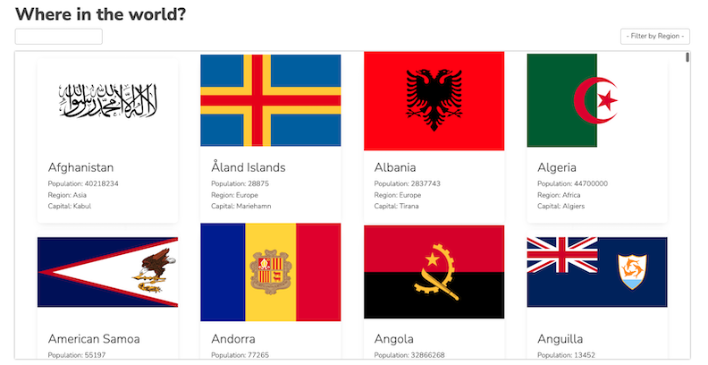

# Frontend Mentor - REST Countries API with color theme switcher solution

This is a solution to the [REST Countries API with color theme switcher challenge on Frontend Mentor](https://www.frontendmentor.io/challenges/rest-countries-api-with-color-theme-switcher-5cacc469fec04111f7b848ca). Frontend Mentor challenges help you improve your coding skills by building realistic projects. 

## Table of contents

- [Overview](#overview)
  - [The challenge](#the-challenge)
  - [Screenshot](#screenshot)
  - [Links](#links)
- [My process](#my-process)
  - [Built with](#built-with)
  - [What I learned](#what-i-learned)
  - [Continued development](#continued-development)
  - [Useful resources](#useful-resources)
- [Author](#author)
- [Acknowledgments](#acknowledgments)

**Note: Delete this note and update the table of contents based on what sections you keep.**

## Overview

### The challenge

Users should be able to:

- See all countries from the API on the homepage
- Search for a country using an `input` field
- Filter countries by region
- Click on a country to see more detailed information on a separate page
- Click through to the border countries on the detail page
- Toggle the color scheme between light and dark mode *(optional)*

### Screenshot

### Links

- Solution URL: [Add solution URL here](https://your-solution-url.com)
- Live Site URL: [Add live site URL here](https://your-live-site-url.com)

## My process

### Built with

- [SvelteKit](https://kit.svelte.dev)
- [MDBootstrap](https://mdbootstrap.com/)

### What I learned

- This helped to practice and develop apps in SvelteKit and best way to showcase our skills.

### Continued development

- This is an amazing site that provides challenges to be implemented of the framework of choice. This will enable to develop the same challenge app using different frameworks.

### Useful resources

- [SvelteKit](https://kit.svelte.dev) - This helped me for creating frontend app. I really liked this pattern and will use it going forward.
- [MDBootstrap](https://mdbootstrap.com/) - This is an amazing CSS framework.

## Author

- Website - [Srikant Gudi](https://github.com/srikantgudi)
- Frontend Mentor - [@srikantgudi](https://www.frontendmentor.io/profile/srikantgudi)
